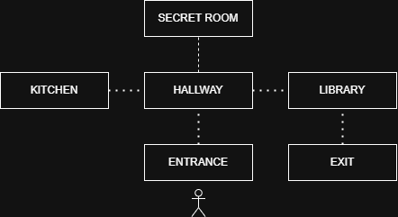

# Laborator LFA
by Nedelcu Alexandru-Constantin (141)

University of Bucharest, Faculty of Mathematics and Computer Science, Year 1, 2024-2025

This repository contains all the lab work I had to do during the course of the semester for LFA (Limbaje Formale si Automate) / Formal Languages and Automata / CS112.

You can find Python implementations for automata such as DFA, NFA, PDA and Turing Machine (+ an extra mini-game for DFA).

## 1. Deterministic Finite Automata (DFA)

### a. DFA implementation
The script can be found in the DFA folder. It takes an input file (format presented below) and keeps the arguments in a dictionary. Along the way the program checks for the validity of the arguments it receives. You can also check if a given string is accepted or rejected by the DFA.

There needs to be a start and an end state!

The user has the option of giving the input file and the strings that will be checked as arguments. If not, the program has predefined tests for the automat_DFA.txt file. 

File format:

```
[STATES] - on every line: state_name [, start] / [, end] (one state need to be labeled as start, another as end)
[SIGMA] - input alphabet (one symbol for every line)
[RULES] - transition rules: source_state, symbol, destination_state
[END] - marks the end of a section
Comments : #
*Not case-sensitive
```

File example:

```
# accepts only strings that end in 0 or that have an even number of 1s after the last 0
[STateS]
q0, start
q1, end
[EnD]
[SigmA]
0
1
[END]
[RULES]
q0,0,q1
q0,1,q1
q1,0,q1
q1,1,q0
[END]
```
Run script (while in the DFA directory):
```
python3 ./dfa.py [filename] [string1] [string2] ... [stringn]
```

### b. DFA Game

This simple game uses a DFA to map the way the player can navigate through multiple rooms. You start at the entrance and have to make your way towards the exit.

Map:


There are 2 level types:
* level = 1 -> Game ends when you reach the exit room.
* level = 2  -> You need to equip a spoon from the kitchen to be able to access the exit room.

Run script (while in the DFA directory):
```
python3 ./dfa_game.py 
```

## 2. Non-deterministic Finite Automata (NFA)

The script can be found in the NFA folder. It works similarly to the DFA version but, because of nondeterminism, includes branching whenever multiple transitions are possible from a single state under the same input symbol (or ε). To manage this, the implementation repeatedly computes an ε-closure: starting from a set of states, it follows all ε‐transitions recursively to collect every state reachable without consuming any input. 

At each step of processing the input string, the NFA first takes the ε‐closure of the current state set, then for each symbol in the input, it finds all destination states reachable under that symbol, and immediately takes the ε‐closure of those new states before proceeding. This symbol move followed by ε‐closure makes sure that the automata correctly checks every possible configuration. 

Finally, after reading all input symbols and taking a last ε‐closure, the NFA accepts if any of the reachable states is marked as a final state.

File format:

```
[STATES] - on every line: state_name [, start] / [, end] (one state need to be labeled as start, another as end)
[SIGMA] - input alphabet (one symbol for every line)
[RULES] - transition rules: source_state, symbol, destination_state
[END] - marks the end of a section
Comments : #
*Not case-sensitive
```

File example:

```
# accepts only strings ending in 01
[STATES]
q0, start
q1
q2, end
[END]

[SIGMA]
0
1
[END]

[RULES]
q0, 0, q0
q0, 0, q1
q0, 1, q0
q1, 1, q2
q1, eps, q0
[END]

```
Run script (while in the NFA directory):
```
python3 ./nfa.py [filename] [string1] [string2] ... [stringn]
```

## 3. Push-Down Automata (PDA)

The script can be found in the PDA folder. The PDA stores a list of transitions, each specifying a source state, an input symbol (or ε), a stack symbol to pop (or ε), a destination state, and a string of stack symbols to push (or ε). 

It begins in a designated start state with a single bottom-of-stack marker ($) and explores all possible configurations breadth‐first (up to a given step limit), allowing ε‐moves and multiple stack operations per transition. Acceptance is by final state when the entire input has been read.

File format:

```
[STATES] - on every line: state_name [, start] / [, end] (one state need to be labeled as start, another as end)
[SIGMA] - input alphabet (one symbol for every line)
[GAMMA] - stack symbol
[RULES] - transition rules: source_state, symbol_input (or eps), stack_pop (or eps), destination_state, stack_push (or eps)
[END] - marks the end of a section
Comments : #
*Not case-sensitive
```

File example:

```
# accepts string with the format (a^n)(b^n)
[STATES]
q0, start
q1
q2, end
[END]

[SIGMA]
a
b
[END]

[GAMMA]
a
$
[END]

[RULES]

q0, eps, eps, q2, eps
q0, a, eps, q0, a
q0, b, a, q1, eps
q1, b, a, q1, eps
q1, eps, $, q2, eps

[END]
```
Run script (while in the PDA directory):
```
python3 ./pda.py [filename] [string1] [string2] ... [stringn]
```
## 4. Turing Machine

The script can be found in the Turing Machine folder. There is a slight difference from the other automata for the command line arguments: the script expects a pair (filename, string) for every run.
The tape is initialized as a list of blanks of a fixed length (or with an input string inserted to the left). The head starts at position 0 in the designated start state. 
At each step, it moves through the list of rules to find one whose current state and tape symbol match, writes the new symbol, moves the head left or right, and updates the state. Execution continues until either no rule applies or the TM enters its designated end state, after which the final tape contents are returned.

File format:

```
[STATES] - on every line: state_name [, start] / [, end] (one state need to be labeled as start, another as end)
[CHARACTERS] - input alphabet (one symbol per line)
[DIRECTIONS] - all possible (L/R)
[RULES] - transition rules: (source_state, symbol) -> (destination_state, symbol, direction)
[END] - marks the end of a section
Comments : #
*Not case-sensitive
```

File example:

```
# scrie 1 0 1 0 si se opreste
[STATES]
q0, start
q1
q2
q3
STOP, end
[END]
[CHARACTERS]
space
0
1
[END]
[DIRECTIONS]
L
R
[END]
[RULES]
(q0,  ) -> (q1, 1, R)    # scrie 1
(q1,  ) -> (q2, 0, R)    # scrie 0
(q2,  ) -> (q3, 1, R)    # scrie 1
(q3,  ) -> (STOP, 0, R)  # scrie 0 şi opreşte
[END]
```
Run script (while in the Turing Machine directory):
```
python3 ./turing.py [filename1] [string1] [filename2] [string2] ... [filnamen][stringn]
```

